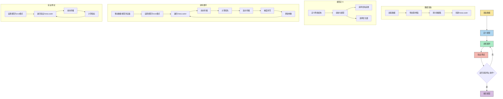

## Loss


```python
from monai.losses import DiceCELoss,DiceLoss,  DiceFocalLoss
```

其他loss可以再下面文件中找到：`/monai/losses/__init__.py`

```markmap
# Loss
## Dice
### DiceFocalLoss
### GeneralizedDiceFocalLoss
### GeneralizedDiceLoss
### GeneralizedWassersteinDiceLoss
### MaskedDiceLoss
```


### CrossEntropyLoss


pytorch的CrossEntropyLoss函数中的解释。
$$
\ell(x, y) = L = \{l_1,\dots,l_N\}^\top, \quad
          l_n = - w_{y_n} \log \frac{\exp(x_{n,y_n})}{\sum_{c=1}^C \exp(x_{n,c})}
          \cdot \mathbb{1}\{y_n \not= \text{ignore\_index}\}
$$


$$
\ell(x, y) = \begin{cases}
              \sum_{n=1}^N \frac{1}{\sum_{n=1}^N w_{y_n} \cdot \mathbb{1}\{y_n \not= \text{ignore\_index}\}} l_n, &
               \text{if reduction} = \text{`mean';}\\
                \sum_{n=1}^N l_n,  &
                \text{if reduction} = \text{`sum'.}
            \end{cases}
$$


$$
\ell(x, y) = L = \{l_1,\dots,l_N\}^\top, \quad
          l_n = - \sum_{c=1}^C w_c \log \frac{\exp(x_{n,c})}{\sum_{i=1}^C \exp(x_{n,i})} y_{n,c}
$$


$$
\ell(x, y) = \begin{cases}
              \frac{\sum_{n=1}^N l_n}{N}, &
               \text{if reduction} = \text{`mean';}\\
                \sum_{n=1}^N l_n,  &
                \text{if reduction} = \text{`sum'.}
            \end{cases}
$$


$$
\begin{aligned}
                C ={} & \text{number of classes} \\
                N ={} & \text{batch size} \\
            \end{aligned}
$$


## Metric

`/monai/metrics/__init__.py` 在该路径下可以找到所有Metric。

```markmap
# metric
## DiceMetric
## SurfaceDistanceMetric
## HausdorffDistanceMetric
## MSEMetric

```


```python
from monai.metrics import DiceMetric, SurfaceDistanceMetric, HausdorffDistanceMetric
```

## nets

`/monai/networks/nets/__init__.py`

```python
from monai.networks.nets import UNets
```


## network.utils

`/monai/networks/utils.py`

可导出的接口

```python
__all__ = [
    "one_hot",
    "predict_segmentation",
    "normalize_transform",
    "to_norm_affine",
    "CastTempType",
    "normal_init",
    "icnr_init",
    "pixelshuffle",
    "eval_mode",
    "train_mode",
    "get_state_dict",
    "copy_model_state",
    "save_state",
    "convert_to_onnx",
    "convert_to_torchscript",
    "convert_to_trt",
    "meshgrid_ij",
    "meshgrid_xy",
    "replace_modules",
    "replace_modules_temp",
    "look_up_named_module",
    "set_named_module",
    "has_nvfuser_instance_norm",
    "get_profile_shapes",
]
```


## utils

`/monai/utils/misc.py`

```pyhon
from monai.utils import first, set_determinism
```

```python
__all__ = [
    "zip_with",
    "star_zip_with",
    "first",
    "issequenceiterable",
    "is_immutable",
    "ensure_tuple",
    "ensure_tuple_size",
    "ensure_tuple_rep",
    "to_tuple_of_dictionaries",
    "fall_back_tuple",
    "is_scalar_tensor",
    "is_scalar",
    "progress_bar",
    "get_seed",
    "set_determinism",
    "list_to_dict",
    "MAX_SEED",
    "copy_to_device",
    "str2bool",
    "str2list",
    "MONAIEnvVars",
    "ImageMetaKey",
    "is_module_ver_at_least",
    "has_option",
    "sample_slices",
    "check_parent_dir",
    "save_obj",
    "label_union",
    "path_to_uri",
    "pprint_edges",
    "check_key_duplicates",
    "CheckKeyDuplicatesYamlLoader",
    "ConvertUnits",
    "check_kwargs_exist_in_class_init",
    "run_cmd",
]
```


##  train一般流程

### 流程图

```markmap
# train
## 1. dataset
## 2. define network
## 3. define loss function
## 4. define optimizer
## 5. train loop
```





### 示例


```python
# 1. dataset
train_transforms = train_transforms_alveolar
train_ds, _ = generate_dataset(
    opt["train_dir"], transforms=train_transforms, cache=False)
train_loader = DataLoader(train_ds, batch_size=1,
                          shuffle=True)  # num_workers=4
val_ds, _ = generate_dataset(
    opt["test_dir"], transforms=val_transforms, cache=False)
# val_transforms
val_loader = DataLoader(val_ds, batch_size=1)  # , num_workers=4

# 2. net
device = torch.device('cuda' if torch.cuda.is_available() else 'cpu')
model = UNet(
    spatial_dims=3,
    in_channels=1,
    out_channels=opt["num_classes"],
    channels=(16, 32, 64, 128),  # , 256
    strides=(2, 2, 2),
    num_res_units=2,
    norm=Norm.INSTANCE,
    ).to(device)

# 3. Loss function
loss_function = DiceCELoss(to_onehot_y=True, softmax=True)
# 4. Optimizer
optimizer = torch.optim.Adam(model.parameters(), 1e-4)
dice_metric = DiceMetric(include_background=False, reduction="mean")

max_epochs = opt["epochs"]
val_interval = 3
best_metric = -1
best_metric_epoch = -1
epoch_loss_values = []
metric_values = []
# , to_onehot=opt.num_classes
post_pred = Compose([AsDiscrete(argmax=True)])
# Activations(softmax=True, dim=1), dim=1,
post_label = Compose([AsDiscrete(threshold=0.6)])

for epoch in range(max_epochs):
    model.train()
    epoch_loss = 0
    step = 0
    optimizer.zero_grad()
    s0 = time.time()
    for batch_data in train_loader:
        step += 1
        inputs = batch_data["image"].to(device)  
        labels = batch_data["label"].to(device) 
        outputs = model(inputs)
        loss = loss_function(outputs, labels)
        loss.backward()
        optimizer.step()
        optimizer.zero_grad()
        epoch_loss += loss.item()
        print(
                f"epoch {epoch + 1}/{max_epochs} {step}/{len(train_ds) // train_loader.batch_size}",
                f"train_loss: {loss.item():.4f}",
            )
    print('epoch time: ', time.time() - s0)
    epoch_loss /= step
    epoch_loss_values.append(epoch_loss)
    del inputs, labels, outputs
    torch.cuda.empty_cache()
    logger.info(f"epoch {epoch + 1} average loss: {epoch_loss:.4f}")
    lr = [group["lr"] for group in optimizer.param_groups]
    writer.add_scalar('lr', lr[0], epoch)
    writer.add_scalar('train_loss', epoch_loss, epoch)
    # end epoch -------------------------
        
```


## Transform


```markmap
# LoadImaged 
## 加载图像，字典方式
# EnsureChannelFirstd
## 确保channel最为第一维
# Orientationd
## 指定加载图像的轴方向，内存方向一致取SPL
# ScaleIntensityRanged
## 指定图像缩放，一般缩放到[0,1]或[-1,1]
# RandAffined
## 随机仿射变换，支持旋转、平移、缩放
# RandAdjustConstractd
## 随机调整对比度
# CropForgroundd
## 裁剪前景图像
# Spacingd
## 图像重采样到指定Spacing
# RandCropByPosNegLabeld
## 按照指定正负样本比例裁剪强将和背景图像，指定patch大小
# MapLabelValued
## 映射标签值，用于从多标签图像中抽取指定标签用于训练

```

