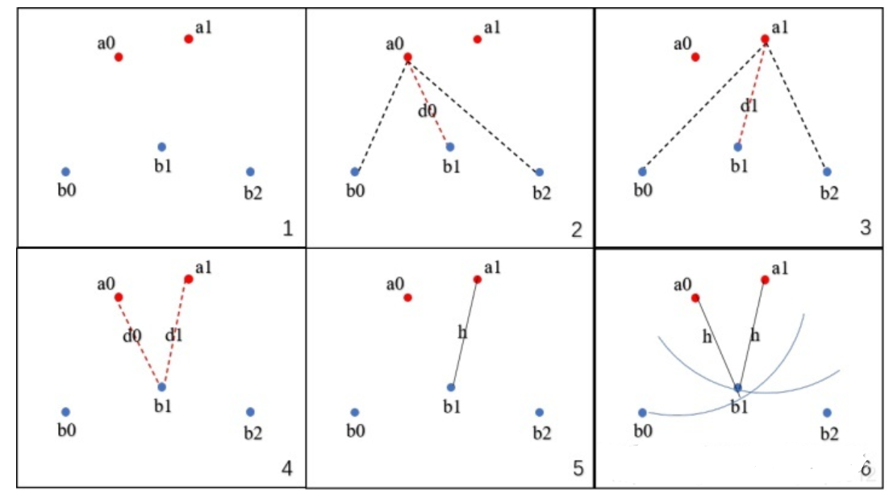

# Metric


图像分割指标有很多，Dice系数、Jaccard系数（IoU）、HHaauusdorff distance.

## Dice系数

- Dice系数是一种集合的相似度度量函数，用于计算两个样本的相似度。
- 值在[0,1]之间，越大表示两个样本越相似，在语义分割中，表示的就是预测结果pred和ground truth之间越相似。
- $Dice = \frac{2|X \cap Y|}{|X| + |Y|}$ 。
- 语义分割还常用Dice loss = 1 - Dice。
- 计算代码如下：

```python
def dice_coeff(pred, target):
    smooth = 1e-7
    num = pred.size(0)
    A= pred.view(num, -1)  # Flatten
    B= target.view(num, -1)  # Flatten
    intersection = (A * B).sum()
    return (2. * intersection + smooth) / (A.sum() + B.sum() + smooth) # smooth防止除数为0

```

- 对于二分类问题，ground truth是只有 0, 1 两个值的，因此上述代码中， |X⋂Y| 是做了相乘的操作，这样是把pred 中未在 GT 分割图中激活（值为1）的所有像素清零。对于激活的像素，主要是惩罚低置信度的预测，较高值会得到更好的 Dice 系数。


## Jaccard系数(IoU)

- Jaccard index，又称为交并比（Intersection over Union)，是用于比较样本集的相似性，定义为两个集合交集大小与并集大小之间的比例。

- $$
  Jaccard = \frac{X \cap Y}{X \cup Y}
  $$

- 计算代码为：

```python
def Iou_coeff(pred, target):
    smooth = 1e-7
    num = pred.size(0)
    A= pred.view(num, -1)  # Flatten
    B= target.view(num, -1)  # Flatten
    intersection = (A * B).sum()
    return (intersection + smooth) / (A.sum() + B.sum() - intersection + smooth) # smooth防止除数为0

```

## Hausdorff distance

**豪斯多夫距离（Hausdorff distance）**：Dice对mask的内部填充比较敏感，而Hausdorff distance 对分割出的边界比较敏感

1）Hausdorff distance是描述两组点集之间相似程度的一种度量，是两个点集之间距离的一种定义形式：假设有两组集合A={a1,…,ap},B={b1,…,bq},则这两个点集合之间的Hausdorff distance定义为：
$$
H(A,B)=MAX(h(A,B), H(B,A)) \tag{1}
$$
其中，
$$
h(A,B)=\underset{a \in A}{max}\{ \underset{b \in B}{min}\parallel a-b \parallel \} \tag{2}
$$

$$
h(B,A)=\underset{b \in B}{max}\{ \underset{a \in A}{min}\parallel b-a \parallel \} \tag{3}
$$

- ‖·‖是点集A和B点集间的距离范式。(如:L2或Euclidean距离).
- 式(1)称为双向Hausdorff distance，是Hausdorff distance的最基本形式；
- 式(2)中的h(A，B)和h(B，A)分别称为从A集合到B集合和从B集合到A集合的单向Hausdorff距离。即h(A,B)实际上首先对点集A中的每个点ai到距离此点ai最近的B集合中点bj之间的距离‖ai-bj‖进行排序，然后取该距离中的最大值作为h(A,B)的值；
- h(B,A)同理可得。
- 由式(1)知，双向Hausdorff距离H(A，B)是单向距离h(A，B)和h(B,A)两者中的较大者，它度量了两个点集间的最大不匹配程度。
  

2）计算流程：给定两个点集合A{ a0, a1, … }和B{ b0, b1, b2, …}
1）取A集合中的一点a0，计算a0到B集合中所有点的距离，保留最短的距离d0
2）遍历A集合中所有点，图中一共两点a0和a1，计算出d0和d1
3）比较所有的距离{ d0, d1 }，选出最长的距离d1
4）这个最长的距离就是h，它是A→B的单向豪斯多夫距离，记为h( A, B）
5）对于A集合中任意一点a，我们可以确定，以点a为圆心，h为半径的圆内部必有B集合中的点
6）交换A集合和B集合的角色，计算B→A的单向豪斯多夫距离h( B, A )，选出h( A, B )和h( B, A )中最长的距离，就是A,B集合的双向豪斯多夫距离



参考：[图像分割评估指标之Hausdorff distance 豪斯多夫距离-CSDN博客](https://blog.csdn.net/lijiaqi0612/article/details/113925215)


## Hausdorff distance

当我们评价图像分割的质量和模型表现时，经常会用到各类表面距离的计算。比如：

- Mean surface distance 平均表面距离
- Hausdorff distance 豪斯多夫距离
- Surface overlap 表面重叠度
- Surface dice 表面dice值
- Volumetric dice 三维dice值
- max_surface_distance 最大表面距离


