[大模型学习路线（5）—— 大模型压缩（量化、剪枝、蒸馏、低秩分解），推理（vllm）_大模型量化和vllm区别-CSDN博客](https://blog.csdn.net/qq_51175703/article/details/138320834)

## 模型压缩

模型压缩通常处于机器学习模型训练和生产部署之间的阶段。它在模型训练完成后，准备将模型部署到目标环境之前进行。

本文针对第二部分量化、剪枝、蒸馏、低秩分解不同的模型压缩算法分类进行了详细分析。具体参考了ZOMI酱老师的课程：[AISystem/04Inference at main · chenzomi12/AISystem (github.com)](https://github.com/chenzomi12/AISystem/tree/main/04Inference)，该文章是ZOMI酱老师课程的学习笔记。

### 模型量化（quantization）

#### 量化概念

型量化是一种将神经网络的浮点算法转换为低比特定点计算的技术（也可以理解为数据映射），它主要适用于需要在资源受限的设备上部署模型的场景，如移动设备、嵌入式系统等。

#### 模型量化优点

（1）提高模型获取参数的时间；（2）参数压缩，加速模型推理时间；（3）减少内存访问开销，节省内存，减少芯片消耗面积，降低能耗。

#### 什么情况下应该/不应该使用模型量化

用场景：（1）资源受限的环境；（2）有实时性要求；（3）能耗敏感的应用；（4）有硬件兼容性；（5）模型部署的便捷性。

不适用场景：（1）有高精度要求的任务；（2）模型仍在迭代开发；（3）缺乏量化支持的硬件；（4）对开发成本敏感的项目；（5）研究和实验阶段。

#### 落地挑战

（1）量化方法：线性量化对数据分布的描述不精确；（2）低比特——从 16 bits ->4 bits 比特数越低，精度损失越大；（3）任务：分类、检测、识别中任务越复杂，精度损失越大；（4）大小：模型越小，精度损失越大。

#### 量化方法

图1. 量化方法比较

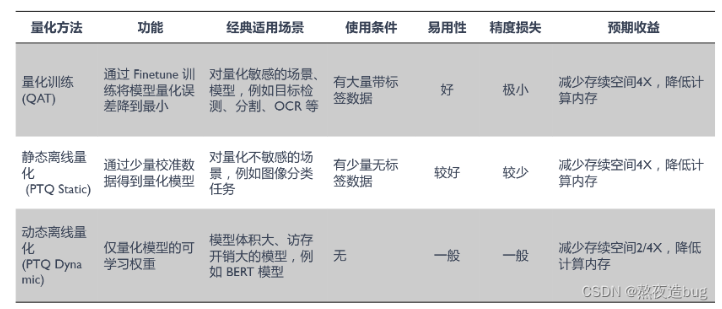

图2. 量化方法比较

##### 量化训练(Quant Aware Training, QAT)

**原理**
（1）量化训练让模型感知量化运算对模型精度带来的影响，通过 finetune 训练降低量化误差；

（2）插入伪量化节点fake quant来模拟量 化引入的误差。端测推理的时候折叠fake quant节点中的属性到tensor中，在端测推理的过程 中直接使用tensor中带有的量化属性参数。

**伪量化节点（fake quant）**
（1）插入伪量化节点来模拟引入的误差，得到数据的分布，找到min和max值；

（2）模拟量化到低比特操作的时候的精度损失，把该损失作用到网络模型中，传递给损失函数， 让优化器去在训练过程中对该损失值进行优化；

（3）一般会在密集计算算子、激活算子、网络输入输出等地方插入伪量化节点。

图3. 量化训练（伪量化节点插入）

##### 动态离线量化(Post Training Quantization Dynamic, PTQ Dynamic)

图4. 动态离线量化（PTQ Dynamic）流程

（1）动态离线量化仅将模型中特定算子的权重从 FP32 类型映射成 INT8/16 类型：权重量化成INT16 类型，模型精度不受影响，模型大小为原始的1/2；权重量化成INT8 类型，模型精度会受到影响，模型大小为原始的1/4；

（2）减小模型大小，对特定加载权重费时的模型可以起到一定加速效果；

（3）是对于不同输入值，其缩放因子是动态计算 ，因此动态量化是几种量化方法中性能最差的。

#####  静态离线量化(Post Training Quantization static, PTQ Static)

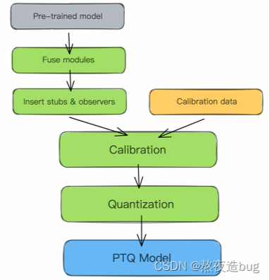

图5. 静态离线量化（PTQ Static）流程

**原理**

（1）静态离线量化使用少量无标签校准数据，核心是计算量化比例因子，量化模型的缩放因子会根据输入数据的分布进行调整；

（2）静态离线量化的目标是求取量化比例因子，主要通过对称量化、非对称量化方式来求，而找最 大值或者阈值的方法又有MinMax、**KL**、ADMM、EQ等方法。

**KL散度校准举例**

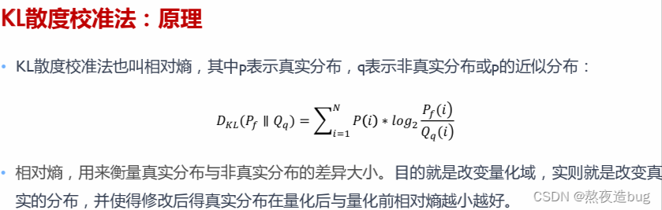

图6. KL散度校准原理    

算法收集激活Act直方图，并生成一组具有不同阈值的8位表示法，选择具有最少[kl 散度](https://so.csdn.net/so/search?q=kl 散度&spm=1001.2101.3001.7020)的表示；此时的 KL 散度在参考分布（FP32激活）和量化分布之间（即8位量化激活）之间。

图7. KL散度校准流程  

### 参数剪枝（pruning）

####  剪枝概念

- 模型量化是指通过减少权重表示或激活所需的比特数来压缩模型；
- 模型剪枝研究模型权重中的冗余，并尝试删除/修剪冗余和非关键的权重。

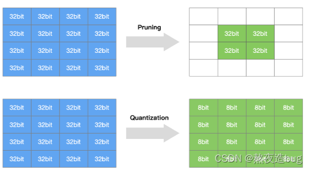

图8. 模型剪枝

#### 剪枝算法分类

#####  Unstructured Pruning(非结构化剪枝 )

方法：随机对独立权重或者神经元链接进行剪枝；
优：剪枝算法简单，模型压缩比高；
缺：精度不可控，剪枝后权重矩阵稀疏，没有专用硬件难以实现压缩和加速的效果。

##### Structured Pruning(结构化剪枝)

方法：对filter / channel / layer 进行剪枝;

优：大部分算法在 channel 或者 layer 上进行剪枝,保留原始卷积结构,不需要专用硬件来实现；

缺：剪枝算法相对复杂。

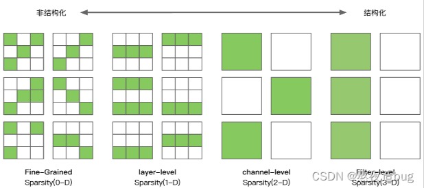

图9. 剪枝算法分类（左：非结构化剪枝 ，右：结构化剪枝）

#### 剪枝算法流程

##### 训练一个模型 ->对模型进行剪枝 -> 对剪枝后模型进行微调

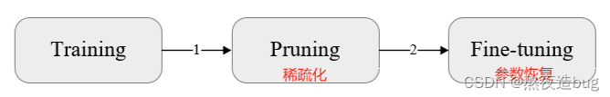

图10

##### 在模型训练过程中进行剪枝 -> 对剪枝后模型进行微调

图11

##### 进行剪枝 -> 从头训练剪枝后模型

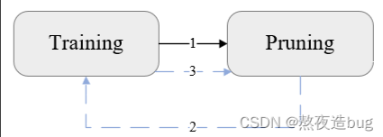

图12

#### L1-Norm剪枝算法

##### 概念

使用 L1-norm 标准来衡量卷积核的重要性，L1-norm 是一个很好的选择卷积核的方法，认为如果一个filter的绝对值和比较小，说明该fiter并不重要。论文指出对剪枝后的网络结构从头训练要比对重新训练剪枝后的网络。

##### 算法步骤

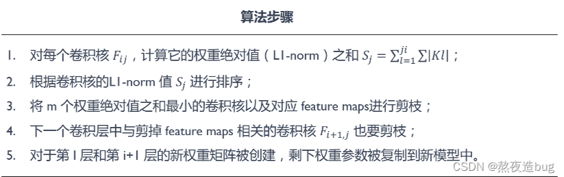

图13

### 知识蒸馏（knowledge distillation）

（Reference：[AISystem/04Inference/03Slim/06.distillation.md at main · chenzomi12/AISystem (github.com)](https://github.com/chenzomi12/AISystem/blob/main/04Inference/03Slim/06.distillation.md))

#### 概览

知识蒸馏算法由三部分组成，分别是**知识**（Knowledge）、**蒸馏算法**（Distillation algorithm）、**师生架构**（Teacher-student architecture）。一般的师生架构如下图所示：

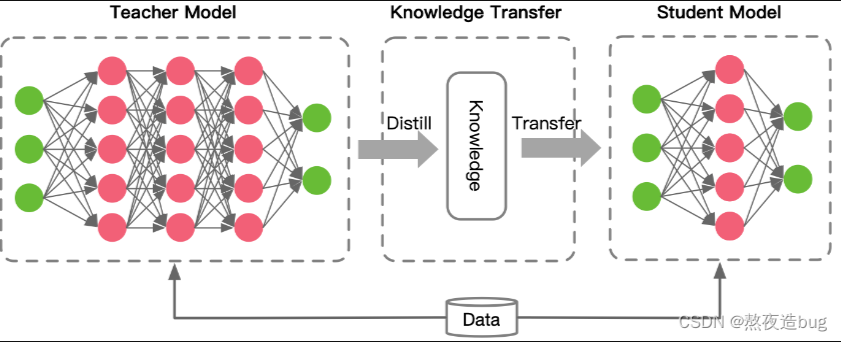

图14

通常，教师网络会比学生网络大，通过知识蒸馏的方法将教师网络的知识转移到学生网络，因此，蒸馏学习可以用于压缩模型，将大模型变成小模型。另外，知识蒸馏的过程需要数据集，这个数据集可以是用于教师模型预训练的数据集，也可以是额外的数据集。

#### 知识类型

知识的类型可以分为四类，主要有 Response-based、Feature-based、Relation-based 三种，而 Architecture-based 类型很少。

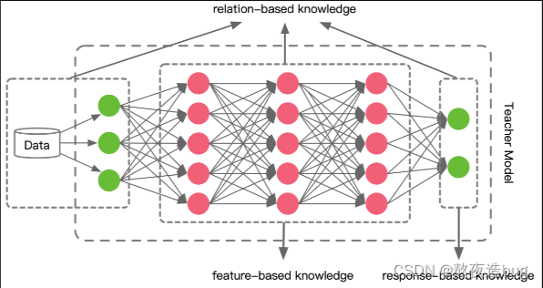

图15

#####  Response-based

当知识蒸馏对这部分知识进行转移时，学生模型直接学习**教师模型输出层的特征**。通俗的说法就是老师充分学习知识后，直接将结论告诉学生。

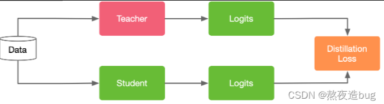

图16

##### Feature-based

上面一种方法学习目标非常直接，学生模型直接学习教师模型的最后预测结果。考虑到深度神经网络善于学习不同层级的特征，教师模型的中间层的特征激活也可以作为学生模型的学习目标，对 Response-based knowledge 形成补充。下面是 Feature-based knowledge 的知识迁移过程。
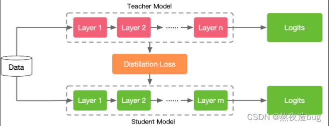

图17

虽然基于特征的知识转移为学生模型的学习提供了更多信息，但由于学生模型和教师模型的结构不一定相同，如何从教师模型中选择哪一层特征激活（提示层），从学生模型中选择哪一层（引导层）模仿教师模型的特征激活，是一个需要探究的问题。另外，当提示层和引导层大小存在差异时，如何正确匹配教师与学生的特征表示也需要进一步探究，目前还没有成熟的方案。

##### Relation-based

上述两种方法都使用了教师模型中特定网络层中特征的输出，而基于关系的知识进一步探索了各网络层输出之间的关系或样本之间的关系。例如将教师模型中两层 feature maps 之间的 Gram 矩阵（网络层输出之间的关系）作为知识，或者将样本在教师模型上的特征表示的概率分布（样本之间的关系）作为知识。
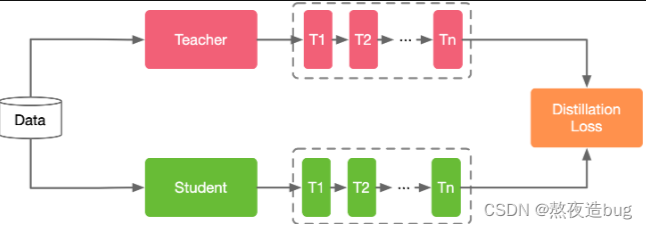

图18

##### Architecture-based

####  蒸馏算法

知识蒸馏的方式一般分为三种：offline distillation；online distillation；self-distillation。

图19

##### offline distillation

这种方法是大部分知识蒸馏算法采用的方法，主要包含两个过程：1）蒸馏前教师模型预训练；2）蒸馏算法迁移知识。因此该方法主要侧重于知识迁移部分。教师模型通常参数量大，训练时间比较长，一些大模型会通过这种方式得到小模型，比如 BERT 通过蒸馏学习得到 tinyBERT。但这种方法的`缺点是学生模型非常依赖教师模型`。

##### online distillation

这种方法要求**教师模型和学生模型同时更新**，主要针对参数量大、精度性能好的教师模型不可获得情况。而现有的方法往往难以获得在线环境下参数量大、精度性能好的教师模型。

##### self-distillation

是 online distillation 的一种特例，教师模型和学生模型采用相同的网络模型。

总结：用学习过程比喻，offline distillation 是知识渊博的老师向学生传授知识；online distillation 是老师和学生一起学习、共同进步；self-distillation 是学生自学成才。

#### 师生架构

### 低秩分解（low-rank factorization）

写累了，不干了，看以下精选的还不错的blog吧：

link 1：[深度学习模型压缩与加速技术（三）：低秩分解-CSDN博客](https://blog.csdn.net/qq_33952811/article/details/124397111)

link 2：[模型压缩之模型分解篇：SVD分解，CP分解和Tucker分解 - 知乎 (zhihu.com)](https://zhuanlan.zhihu.com/p/490455377)

### 模型推理（以vllm为例）

#### Flash Attention

精选链接：[‍⁡⁣‬⁢‬‬⁡⁤‬⁡⁡⁣⁡⁤‍‬‍‌‌⁡⁡‍‍‬⁤⁢⁡⁤⁡‍‌⁡‍⁤‍⁤FlashAttention: 更快训练更长上下文的GPT - 飞书云文档 (feishu.cn](https://readpaper.feishu.cn/docx/AC7JdtLrhoKpgxxSRM8cfUounsh)

图20

#### Page Attention --> KV Cache

精选链接1：[PagedAttention论文解读 - 李理的博客 (fancyerii.github.io)](https://fancyerii.github.io/2023/11/01/pagedattention/#pagedattention)

精选链接2：[PagedAttention(vLLM):更快地推理你的GPT - 飞书云文档 (feishu.cn)](https://readpaper.feishu.cn/docx/EcZxdsf4uozCoixdU3NcW03snwV)
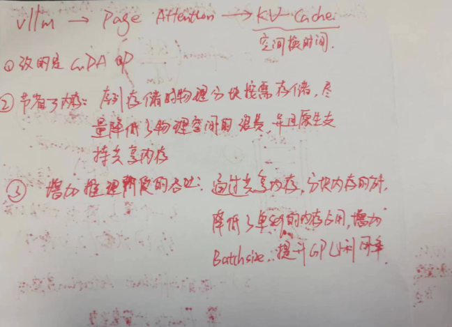

图21

## 模型压缩和加速方法总结和文献综述

[模型压缩和加速方法总结和文献综述_模型加速与压缩技术-CSDN博客](https://blog.csdn.net/senbinyu/article/details/108138988)

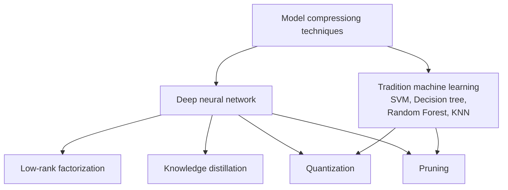

Figure 1. different types of compression techniques for DNN and traditional ML methods. Here, the arrow shows the types of techniques belong to the upper-level hierarchy.

###  Review papers，综述文章

以下是推荐用于模型压缩和加速的几篇论文。

Cheng Yu et al.,  [A survey of model compression and acceleration for deep neural networks](https://arxiv.org/abs/1710.09282), 2017.

Cheng Jian et al.,  [Recent advances in efficient computation of deep convolutional neural networks](https://link.springer.com/content/pdf/10.1631/FITEE.1700789.pdf), 2018.

Deng Yunbin,  [Deep learning on mobile devices: a review](https://www.spiedigitallibrary.org/conference-proceedings-of-spie/10993/109930A/Deep-learning-on-mobile-devices-a-review/10.1117/12.2518469.pdf?casa_token=1vnmem4EqK0AAAAA:xqMq8QcEwl66yyIn8hiChVZBu8BbOPHfYmzND2N1732iHPhEVfAKfxPwrUDRoBwDLDW-BMtgBQ), 2019.

Choudhary, Tejalal et al., [A comprehensive survey on model compression and acceleration](https://link.springer.com/content/pdf/10.1007/s10462-020-09816-7.pdf), 2020.

