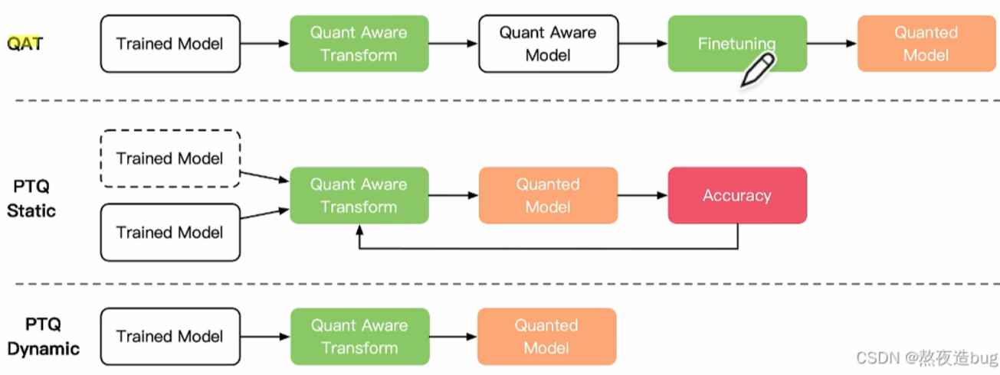
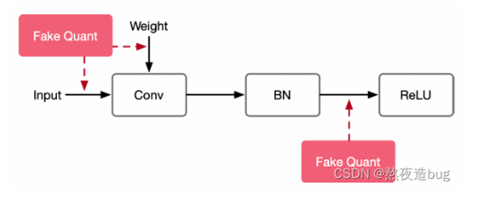
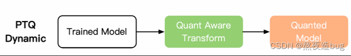
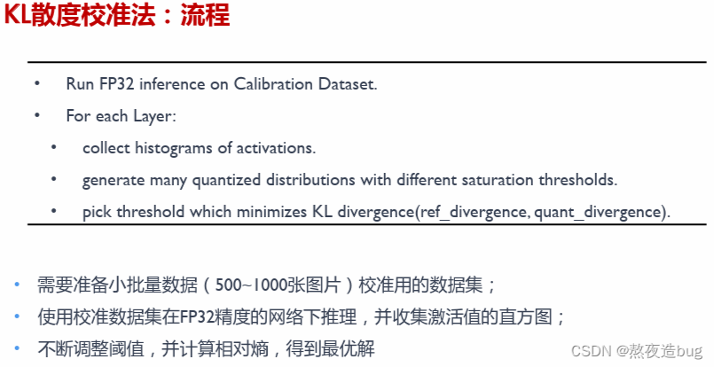
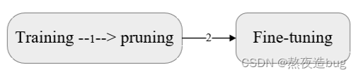

[大模型学习路线（5）—— 大模型压缩（量化、剪枝、蒸馏、低秩分解），推理（vllm）_大模型量化和vllm区别-CSDN博客](https://blog.csdn.net/qq_51175703/article/details/138320834)

## 模型压缩

模型压缩通常处于机器学习模型训练和生产部署之间的阶段。它在模型训练完成后，准备将模型部署到目标环境之前进行。

本文针对第二部分量化、剪枝、蒸馏、低秩分解不同的模型压缩算法分类进行了详细分析。具体参考了ZOMI酱老师的课程：[AISystem/04Inference at main · chenzomi12/AISystem (github.com)](https://github.com/chenzomi12/AISystem/tree/main/04Inference)，该文章是ZOMI酱老师课程的学习笔记。

### 模型量化（quantization）

#### 量化概念

型量化是一种将神经网络的浮点算法转换为低比特定点计算的技术（也可以理解为数据映射），它主要适用于需要在资源受限的设备上部署模型的场景，如移动设备、嵌入式系统等。

#### 模型量化优点

（1）提高模型获取参数的时间；（2）参数压缩，加速模型推理时间；（3）减少内存访问开销，节省内存，减少芯片消耗面积，降低能耗。

#### 什么情况下应该/不应该使用模型量化

用场景：（1）资源受限的环境；（2）有实时性要求；（3）能耗敏感的应用；（4）有硬件兼容性；（5）模型部署的便捷性。

不适用场景：（1）有高精度要求的任务；（2）模型仍在迭代开发；（3）缺乏量化支持的硬件；（4）对开发成本敏感的项目；（5）研究和实验阶段。

#### 落地挑战

（1）量化方法：线性量化对数据分布的描述不精确；（2）低比特——从 16 bits ->4 bits 比特数越低，精度损失越大；（3）任务：分类、检测、识别中任务越复杂，精度损失越大；（4）大小：模型越小，精度损失越大。

#### 量化方法

图1. 量化方法比较

图2. 量化方法比较

##### 量化训练(Quant Aware Training, QAT)

**原理**
（1）量化训练让模型感知量化运算对模型精度带来的影响，通过 finetune 训练降低量化误差；

（2）插入伪量化节点fake quant来模拟量 化引入的误差。端测推理的时候折叠fake quant节点中的属性到tensor中，在端测推理的过程 中直接使用tensor中带有的量化属性参数。

**伪量化节点（fake quant）**
（1）插入伪量化节点来模拟引入的误差，得到数据的分布，找到min和max值；

（2）模拟量化到低比特操作的时候的精度损失，把该损失作用到网络模型中，传递给损失函数， 让优化器去在训练过程中对该损失值进行优化；

（3）一般会在密集计算算子、激活算子、网络输入输出等地方插入伪量化节点。

图3. 量化训练（伪量化节点插入）

##### 动态离线量化(Post Training Quantization Dynamic, PTQ Dynamic)

图4. 动态离线量化（PTQ Dynamic）流程

（1）动态离线量化仅将模型中特定算子的权重从 FP32 类型映射成 INT8/16 类型：权重量化成INT16 类型，模型精度不受影响，模型大小为原始的1/2；权重量化成INT8 类型，模型精度会受到影响，模型大小为原始的1/4；

（2）减小模型大小，对特定加载权重费时的模型可以起到一定加速效果；

（3）是对于不同输入值，其缩放因子是动态计算 ，因此动态量化是几种量化方法中性能最差的。

#####  静态离线量化(Post Training Quantization static, PTQ Static)

图5. 静态离线量化（PTQ Static）流程

**原理**

（1）静态离线量化使用少量无标签校准数据，核心是计算量化比例因子，量化模型的缩放因子会根据输入数据的分布进行调整；

（2）静态离线量化的目标是求取量化比例因子，主要通过对称量化、非对称量化方式来求，而找最 大值或者阈值的方法又有MinMax、**KL**、ADMM、EQ等方法。

**KL散度校准举例**

图6. KL散度校准原理    

算法收集激活Act直方图，并生成一组具有不同阈值的8位表示法，选择具有最少[kl 散度](https://so.csdn.net/so/search?q=kl 散度&spm=1001.2101.3001.7020)的表示；此时的 KL 散度在参考分布（FP32激活）和量化分布之间（即8位量化激活）之间。

图7. KL散度校准流程  

### 参数剪枝（pruning）

####  剪枝概念

- 模型量化是指通过减少权重表示或激活所需的比特数来压缩模型；
- 模型剪枝研究模型权重中的冗余，并尝试删除/修剪冗余和非关键的权重。

图8. 模型剪枝

#### 剪枝算法分类

#####  Unstructured Pruning(非结构化剪枝 )

方法：随机对独立权重或者神经元链接进行剪枝；
优：剪枝算法简单，模型压缩比高；
缺：精度不可控，剪枝后权重矩阵稀疏，没有专用硬件难以实现压缩和加速的效果。

##### Structured Pruning(结构化剪枝)

方法：对filter / channel / layer 进行剪枝;

优：大部分算法在 channel 或者 layer 上进行剪枝,保留原始卷积结构,不需要专用硬件来实现；

缺：剪枝算法相对复杂。

图9. 剪枝算法分类（左：非结构化剪枝 ，右：结构化剪枝）

### 剪枝算法流程

#### 训练一个模型 ->对模型进行剪枝 -> 对剪枝后模型进行微调

图10

#### 在模型训练过程中进行剪枝 -> 对剪枝后模型进行微调

图11

#### 进行剪枝 -> 从头训练剪枝后模型

图12

