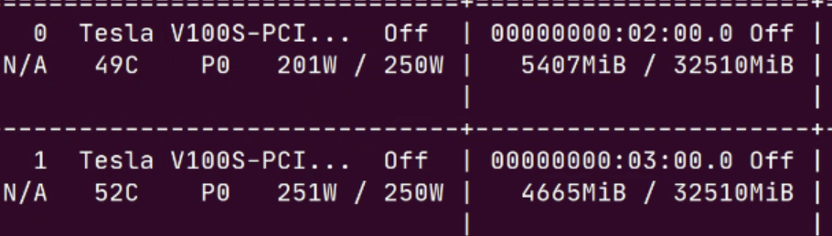
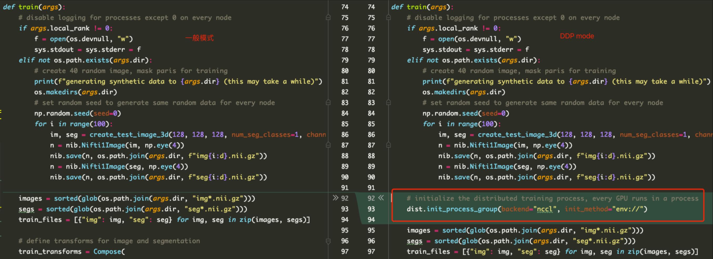
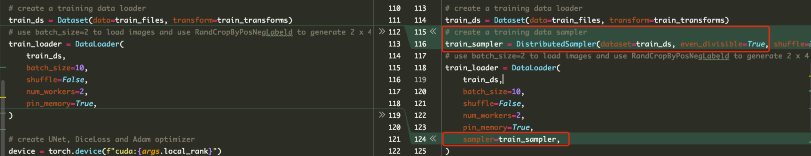
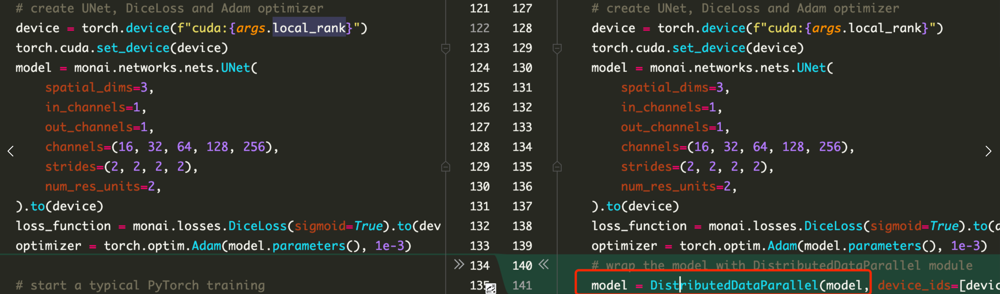
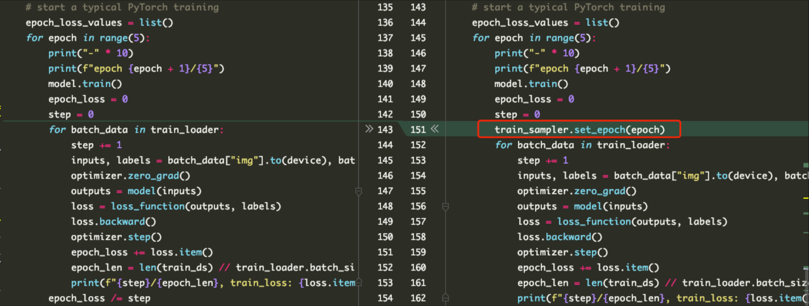
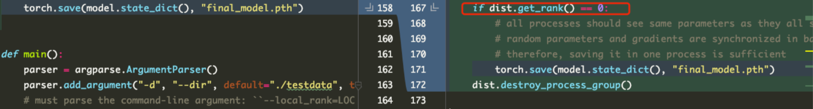
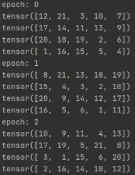

## 分布式训练

[[理论+实操\] MONAI&PyTorch 如何进行分布式训练，详细介绍DP和DDP-CSDN博客](https://blog.csdn.net/u014264373/article/details/127011482)

### 为什么要使用分布式训练

于懒癌星人，单卡训练能解决的问题，再多卡给我，我都懒得用。但是对于资深炼丹师，分布式训练带来的收益很大，可以加速模型的训练、调参的节奏、以及版本的迭代更新等~

当你遇到以下情况，可以考虑使用分布式训练（使用多张卡，或者多台服务器）

在理想的batc_size下，单卡训练 out of memory
使用单卡虽然能run, 但是速度非常慢，耗时。
数据量太大，需要利用所有资源满足训练。
模型太大，单机内存不足
等…

### 分布式训练有哪些方法

分布式训练策略按照并行方式不同，可以简单的分为**数据并行**和**模型并行**两种方式。[原文链接](https://cloud.tencent.com/developer/news/841792)

1️⃣ 数据并行
数据并行是指在不同的 GPU 上都 copy 保存一份模型的副本，然后将不同的数据分配到不同的 GPU 上进行计算，最后将所有 GPU 计算的结果进行合并，从而达到加速模型训练的目的。由于数据并行会涉及到把不同 GPU 的计算结果进行合并然后再更新模型，根据跟新方式不同，又可以分为同步更新和异步更新

2️⃣ 模型并行
分布式训练中的模型并行是指将整个神经网络模型拆解分布到不同的 GPU 中，不同的 GPU 负责计算网络模型中的不同部分。这通常是在网络模型很大很大、单个 GPU 的显存已经完全装不下整体网络的情况下才会采用。


### 基于 Pytorch 的分布式训练方法

 Pytorch 中为我们提供了两种多 GPU 的分布式训练方案： torch.nn.DataParallel（DP）和 torch.nn.parallel.Distributed Data Parallel（DDP)

#### DP(DataParallel)

[原文链接](https://blog.csdn.net/laizi_laizi/article/details/115299263)

优点：修改的代码量最少，只要像这样model = nn.DataParallel(model)包裹一下你的模型就行了
缺点：只适用单机多卡，不适用多机多卡；性能不如DDP; DP使用单进程，目前官方已经不推荐。
如果觉得 DDP 很难，可以采用这种方式。示例用法

```python
import monai
import torch.nn as nn
import os

os.environ("CUDA_VISIBLE_DEVICES") = '0,1' 
# 用哪些卡，就写哪些，也可以在命令行运行的时候指定可见GPU
# $: export CUDA_VISIBLE_DEVICES=0,1 python train.py
device = torch.device('cuda' if torch.cuda.is_available () else 'cpu')
model = monai.networks.nets.UNet().to(device)
model = nn.DataParallel(model)

```

通过两种方式可以指定需要使用的GPU，第一种是在代码里设置`os.environ`, 第二种是在终端运行代码前，加一句`export CUDA_VISIBLE_DEVICES=0,1`。按照自己的习惯来就行。

如果需要跑来看看效果，可以执行下面的代码，完整版

```python
import argparse
import os
import sys
from glob import glob

import nibabel as nib
import numpy as np
import torch
import torch.distributed as dist
from torch.nn.parallel import DistributedDataParallel

import monai
from monai.data import DataLoader, Dataset, create_test_image_3d, DistributedSampler
from monai.transforms import (
    AsChannelFirstd,
    Compose,
    LoadImaged,
    RandCropByPosNegLabeld,
    RandRotate90d,
    ScaleIntensityd,
    EnsureTyped,
)


def train(args):
    if not os.path.exists(args.dir):
        # create 40 random image, mask paris for training
        print(f"generating synthetic data to {args.dir} (this may take a while)")
        os.makedirs(args.dir)
        # set random seed to generate same random data for every node
        np.random.seed(seed=0)
        for i in range(200):
            im, seg = create_test_image_3d(128, 128, 128, num_seg_classes=1, channel_dim=-1)
            n = nib.Nifti1Image(im, np.eye(4))
            nib.save(n, os.path.join(args.dir, f"img{i:d}.nii.gz"))
            n = nib.Nifti1Image(seg, np.eye(4))
            nib.save(n, os.path.join(args.dir, f"seg{i:d}.nii.gz"))

    images = sorted(glob(os.path.join(args.dir, "img*.nii.gz")))
    segs = sorted(glob(os.path.join(args.dir, "seg*.nii.gz")))
    train_files = [{"img": img, "seg": seg} for img, seg in zip(images, segs)]

    # define transforms for image and segmentation
    train_transforms = Compose(
        [
            LoadImaged(keys=["img", "seg"]),
            AsChannelFirstd(keys=["img", "seg"], channel_dim=-1),
            ScaleIntensityd(keys="img"),
            RandCropByPosNegLabeld(
                keys=["img", "seg"], label_key="seg", spatial_size=[96, 96, 96], pos=1, neg=1, num_samples=4
            ),
            RandRotate90d(keys=["img", "seg"], prob=0.5, spatial_axes=[0, 2]),
            EnsureTyped(keys=["img", "seg"]),
        ]
    )

    # create a training data loader
    train_ds = Dataset(data=train_files, transform=train_transforms)
    # use batch_size=2 to load images and use RandCropByPosNegLabeld to generate 2 x 4 images for network training
    train_loader = DataLoader(
        train_ds,
        batch_size=10,
        shuffle=False,
        num_workers=2,
        pin_memory=True,
    )

    # create UNet, DiceLoss and Adam optimizer
    device = torch.device('cuda' if torch.cuda.is_available() else 'cpu')
    model = monai.networks.nets.UNet(
        spatial_dims=3,
        in_channels=1,
        out_channels=1,
        channels=(16, 32, 64, 128, 256),
        strides=(2, 2, 2, 2),
        num_res_units=2,
    ).to(device)
    model = torch.nn.DataParallel(model)
    loss_function = monai.losses.DiceLoss(sigmoid=True).to(device)
    optimizer = torch.optim.Adam(model.parameters(), 1e-3)

    # start a typical PyTorch training
    epoch_loss_values = list()
    for epoch in range(5):
        print("-" * 10)
        print(f"epoch {epoch + 1}/{5}")
        model.train()
        epoch_loss = 0
        step = 0
        for batch_data in train_loader:
            step += 1
            inputs, labels = batch_data["img"].to(device), batch_data["seg"].to(device)
            optimizer.zero_grad()
            outputs = model(inputs)
            loss = loss_function(outputs, labels)
            loss.backward()
            optimizer.step()
            epoch_loss += loss.item()
            epoch_len = len(train_ds) // train_loader.batch_size
            print(f"{step}/{epoch_len}, train_loss: {loss.item():.4f}")
        epoch_loss /= step
        epoch_loss_values.append(epoch_loss)
        print(f"epoch {epoch + 1} average loss: {epoch_loss:.4f}")
    print(f"train completed, epoch losses: {epoch_loss_values}")
    torch.save(model.state_dict(), "final_model.pth")


def main():
    parser = argparse.ArgumentParser()
    parser.add_argument("-d", "--dir", default="./testdata", type=str, help="directory to create random data")
    args = parser.parse_args()

    train(args=args)

if __name__ == "__main__":
    import os
    os.environ["CUDA_VISIBLE_DEVICES"] = '0,1'
    main()

```

这里我们使用了2块GPU，运行的时候可以看下两块GPU的使用情况.




#### DDP(DistributedDataParallel)

次重点介绍：⭐️⭐️⭐️⭐️⭐️

与 DP 模式不同，DDP 模式本身是为多机多卡设计的，当然在单机多卡的情况下也可以使用。DDP 采用的是 all-reduce 架构，基本解决了 PS 架构中通信成本与 GPU 的数量线性相关的问题。虽然在单机多卡情况下，可以使用 DP 模式，但是使用 DDP 通常会比 DP 模式快一些，因此 DDP 模式也是官方推荐大家使用的方式。

DDP为基于torch.distributed的分布式数据并行结构，工作机制为：在batch维度上对数据进行分组，将输入的数据分配到指定的设备（GPU）上，从而将程序的模型并行化。对应的，每个GPU上会复制一个模型的副本，负责处理分配到的数据，在后向传播过程中再对每个设备上的梯度进行平均。

缺点：代码改动较DP多，坑较多，需要试错攒经验

DDP的启动方式有很多种，内容上是统一的：都是启动多进程来完成运算。

- torch.multiprocessing.spawn：适用于单机多卡
- torch.distributed.launch: 可用于多机或多卡。

接下来以`torch.distributed.launch`为例，只需要8步，将你的代码改成分布式训练。适用于单机多卡。

##### step 1： 初始化进程

```python
import torch.distributed as dist
dist.init_process_group(backend="nccl", init_method="env://")
```

参数解析：
在创建模型之前进行初始化

- backend: 后端通信可以采用`mpi`, `gloo`,and `nccl`。对于基于 GPU 的训练，建议使用 `nccl` 以获得最佳性能.
- init_method: 告知每个进程如何发现彼此，如何使用通信后端初始化和验证进程组。 默认情况下，如果未指定 init_method，PyTorch 将使用环境变量初始化方法 (env://)。
  



图片左边为常规代码，右边为DDP修改后的代码

##### step 2: 在创建dataloder前加一个sampler

```python
from monai.data import DistributedSampler
 # create a training data loader
train_ds = Dataset(data=train_files, transform=train_transforms)
# create a training data sampler
train_sampler = DistributedSampler(dataset=train_ds, even_divisible=True, shuffle=True)
# use batch_size=2 to load images and use RandCropByPosNegLabeld to generate 2 x 4 images for network training
train_loader = DataLoader(
    train_ds,
    batch_size=10,
    shuffle=False,
    num_workers=2,
    pin_memory=True,
    sampler=train_sampler,
)
```

与常规训练的区别👇红框内为新增内容



##### step 3: 设定Device

```python
device = torch.device(f"cuda:{args.local_rank}")
torch.cuda.set_device(device)
```

这里涉及到的参数在后面(step 7)给出
这一步，常规的代码也可以这样写，但平时一般用如下方法

```python
device = torch.device('cuda' if torch.cuda.is_available() else 'cpu')
```

##### step 4: 使用DistributedDataParallel模块包裹模型

```python
from torch.nn.parallel import DistributedDataParallel
model = monai.networks.nets.UNet(
        spatial_dims=3,
        in_channels=1,
        out_channels=1,
        channels=(16, 32, 64, 128, 256),
        strides=(2, 2, 2, 2),
        num_res_units=2,
    ).to(device)
model = DistributedDataParallel(model, device_ids=[device], output_device=[device])

```

> model.to(device) # 这句不能少，最好不要用model.cuda()

与常规对比



##### step 5: 在epoch训练前设置`set_epoch`

```python
train_sampler.set_epoch(epoch)
```



在后面解释为什么要设置`set_epoch`

##### step 6: 修改模型的保存方式

因为每个进程的模型是一样的，我们只用在某一个进程上保存模型就行，默认使用0进程保存模型

```python
if dist.get_rank() == 0:
    # all processes should see same parameters as they all start from same
    # random parameters and gradients are synchronized in backward passes,
    # therefore, saving it in one process is sufficient
    torch.save(model.state_dict(), "final_model.pth")
```



##### step 7: 在main函数里面添加local_rank参数

```python
def main():
    parser = argparse.ArgumentParser()
    parser.add_argument("-d", "--dir", default="./testdata", type=str, help="directory to create random data")
    # must parse the command-line argument: ``--local_rank=LOCAL_PROCESS_RANK``, which will be provided by DDP
    parser.add_argument("--local_rank", type=int, default=0)
    args = parser.parse_args()

    train(args=args)
```

7步已经改完了所有代码，接下来copy完整代码，尝试跑通💪💪

**完整代码如下**

```python
import argparse
import os
import sys
from glob import glob

import nibabel as nib
import numpy as np
import torch
import torch.distributed as dist
from torch.nn.parallel import DistributedDataParallel

import monai
from monai.data import DataLoader, Dataset, create_test_image_3d, DistributedSampler
from monai.transforms import (
    AsChannelFirstd,
    Compose,
    LoadImaged,
    RandCropByPosNegLabeld,
    RandRotate90d,
    ScaleIntensityd,
    EnsureTyped,
)


def train(args):
    # disable logging for processes except 0 on every node
    if args.local_rank != 0:
        f = open(os.devnull, "w")
        sys.stdout = sys.stderr = f
    elif not os.path.exists(args.dir):
        # create 40 random image, mask paris for training
        print(f"generating synthetic data to {args.dir} (this may take a while)")
        os.makedirs(args.dir)
        # set random seed to generate same random data for every node
        np.random.seed(seed=0)
        for i in range(100):
            im, seg = create_test_image_3d(128, 128, 128, num_seg_classes=1, channel_dim=-1)
            n = nib.Nifti1Image(im, np.eye(4))
            nib.save(n, os.path.join(args.dir, f"img{i:d}.nii.gz"))
            n = nib.Nifti1Image(seg, np.eye(4))
            nib.save(n, os.path.join(args.dir, f"seg{i:d}.nii.gz"))

    # initialize the distributed training process, every GPU runs in a process
    dist.init_process_group(backend="nccl", init_method="env://")

    images = sorted(glob(os.path.join(args.dir, "img*.nii.gz")))
    segs = sorted(glob(os.path.join(args.dir, "seg*.nii.gz")))
    train_files = [{"img": img, "seg": seg} for img, seg in zip(images, segs)]

    # define transforms for image and segmentation
    train_transforms = Compose(
        [
            LoadImaged(keys=["img", "seg"]),
            AsChannelFirstd(keys=["img", "seg"], channel_dim=-1),
            ScaleIntensityd(keys="img"),
            RandCropByPosNegLabeld(
                keys=["img", "seg"], label_key="seg", spatial_size=[96, 96, 96], pos=1, neg=1, num_samples=4
            ),
            RandRotate90d(keys=["img", "seg"], prob=0.5, spatial_axes=[0, 2]),
            EnsureTyped(keys=["img", "seg"]),
        ]
    )

    # create a training data loader
    train_ds = Dataset(data=train_files, transform=train_transforms)
    # create a training data sampler
    train_sampler = DistributedSampler(dataset=train_ds, even_divisible=True, shuffle=True)
    # use batch_size=2 to load images and use RandCropByPosNegLabeld to generate 2 x 4 images for network training
    train_loader = DataLoader(
        train_ds,
        batch_size=10,
        shuffle=False,
        num_workers=2,
        pin_memory=True,
        sampler=train_sampler,
    )

    # create UNet, DiceLoss and Adam optimizer
    device = torch.device(f"cuda:{args.local_rank}")
    torch.cuda.set_device(device)
    model = monai.networks.nets.UNet(
        spatial_dims=3,
        in_channels=1,
        out_channels=1,
        channels=(16, 32, 64, 128, 256),
        strides=(2, 2, 2, 2),
        num_res_units=2,
    ).to(device)
    loss_function = monai.losses.DiceLoss(sigmoid=True).to(device)
    optimizer = torch.optim.Adam(model.parameters(), 1e-3)
    # wrap the model with DistributedDataParallel module
    model = DistributedDataParallel(model, device_ids=[device], output_device=[device])

    # start a typical PyTorch training
    epoch_loss_values = list()
    for epoch in range(5):
        print("-" * 10)
        print(f"epoch {epoch + 1}/{5}")
        model.train()
        epoch_loss = 0
        step = 0
        train_sampler.set_epoch(epoch)
        for batch_data in train_loader:
            step += 1
            inputs, labels = batch_data["img"].to(device), batch_data["seg"].to(device)
            optimizer.zero_grad()
            outputs = model(inputs)
            loss = loss_function(outputs, labels)
            loss.backward()
            optimizer.step()
            epoch_loss += loss.item()
            epoch_len = len(train_ds) // train_loader.batch_size
            print(f"{step}/{epoch_len}, train_loss: {loss.item():.4f}")
        epoch_loss /= step
        epoch_loss_values.append(epoch_loss)
        print(f"epoch {epoch + 1} average loss: {epoch_loss:.4f}")
    print(f"train completed, epoch losses: {epoch_loss_values}")
    if dist.get_rank() == 0:
        # all processes should see same parameters as they all start from same
        # random parameters and gradients are synchronized in backward passes,
        # therefore, saving it in one process is sufficient
        torch.save(model.state_dict(), "final_model.pth")
    dist.destroy_process_group()


def main():
    parser = argparse.ArgumentParser()
    parser.add_argument("-d", "--dir", default="./testdata", type=str, help="directory to create random data")
    # must parse the command-line argument: ``--local_rank=LOCAL_PROCESS_RANK``, which will be provided by DDP
    parser.add_argument("--local_rank", type=int, default=0)
    args = parser.parse_args()

    train(args=args)

if __name__ == "__main__":
    main()

```

完整代码来自 [MONAI DDP教程](https://github.com/Project-MONAI/tutorials/blob/main/acceleration/distributed_training/unet_training_ddp.py)

##### step 8: 终端启动DDP训练

这里的启动方式选择[torch.distributed.launch](https://pytorch.org/docs/stable/distributed.html#launch-utility)

使用该模块启动训练，分单机多卡和多机多卡

- Single-Node multi-process（单机多卡）

```bash
python -m torch.distributed.launch --nproc_per_node=NUM_GPUS_YOU_HAVE YOUR_TRAINING_SCRIPT.py (--arg1 --arg2 --arg3 and all other arguments of your training script)
```

这里使用单机，因此节点nnodes=1（可以理解为几台服务器）, `nproc_per_node`参数指定节点上有多少块GPU可用。例如服务器上有2块GPU，`nproc_per_node=2`。假如有8块，我只想用其中的4块。则可以通过2种方式指定（如何指定GPU,详见上文 DP(DataParallel)部分）
```bash
export CUDA_VISIBLE_DEVICES=0,1,2,3 python -m torch.distributed.launch --nproc_per_node=4 train.py -d "./testdata"
```

- Multi-Node multi-process(多机多卡)

```bash
python -m torch.distributed.launch --nproc_per_node=NUM_GPUS_YOU_HAVE --nnodes=2 --node_rank=0 --master_addr="192.168.1.1" --master_port=1234 
YOUR_TRAINING_SCRIPT.py (--arg1 --arg2 --arg3 and all other arguments of your training script)
```

使用几台机器，nnodes就等于几。另外，需要添加`master_addr`和`master_port`两个参数，默认使用第一个节点的IP和端口号。这两个参数的具体使用可通过下面命令查看，该模块的更多可选参数也可以使用如下命令查看

```bash
python -m torch.distributed.launch --help
```

以上就是使用DDP训练的全过程。如果顺利的话，㊗️福你，you are so lucky.


### 经验总结

以下是一些经验总结，失败的朋友继续往下看😂

#### 注意一：使用分布式需设置set_epoch

分布式模式下，需要在每个epoch开始时调用set_epoch方法，然后再创建Dataloader迭代器，以使shuffle生效，否则，每个epoch中，选择数据的顺序不会变。参考 pytorch DistributedSampler 官方代码

正确使用姿势
```python
sampler = DistributedSampler(dataset) if is_distributed else None
loader = DataLoader(dataset, shuffle=(sampler is None),
                    sampler=sampler)
for epoch in range(start_epoch, n_epochs):
    if is_distributed:
        sampler.set_epoch(epoch)
    train(loader)

```

我们可以做个实验，验证一下是不是这样。

先创建一个随机data，并使用sampler进行采样，再送入dataloader

```python
import torch
from torch.utils.data import Dataset, DataLoader


class RandomDataset(Dataset):
    def __init__(self):
        self.data = torch.randn(21, 1, 32, 32)
        self.name = torch.arange(1, 22)  # 这里从1开始， 所有是22，不是21

    def __getitem__(self, idx):
        return self.name[idx], self.data[idx]

    def __len__(self):
        return len(self.data)


torch.distributed.init_process_group(backend='nccl')

dataset = RandomDataset()
sampler = torch.utils.data.distributed.DistributedSampler(dataset, shuffle=True)
dataloader = DataLoader(dataset,
                        batch_size=5,
                        drop_last=True,
                        sampler=sampler)

```

实验一：不使用`set_epoch`

```python
for epoch in range(3):
    print(f'epoch: {epoch}')
    # sampler.set_epoch(epoch)  # 注释掉这行
    for i, data in enumerate(dataloader, 0):
        names, _ = data
        print(names)
```


从结果可以看到，每个epoch使用的data数据顺序都是一模一样的，并没有shuffle

实验二：使用`set_epoch`

```python
for epoch in range(3):
    print(f'epoch: {epoch}')
    sampler.set_epoch(epoch)  # 注释掉这行
    for i, data in enumerate(dataloader, 0):
        names, _ = data
        print(names)
```



从图上可以看到，使用`set_epoch`后shuffle起作用了。

#### 注意二：相关概念说明

- rank：用于表示进程的编号/序号（在一些结构图中rank指的是软节点，rank可以看成一个计算单位），每一个进程对应了一个rank的进程，整个分布式由许多rank完成。
- node：物理节点，可以是一台机器也可以是一个容器，节点内部可以有多个GPU。
- rank与local_rank： rank是指在整个分布式任务中进程的序号；local_rank是指在一个node上进程的相对序号，local_rank在node之间相互独立。
- nnodes、node_rank与nproc_per_node： nnodes是指物理节点数量，node_rank是物理节点的序号；nproc_per_node是指每个物理节点上面进程的数量。
- word size ： 全局（一个分布式任务）中，rank的数量。
  [概念解析](https://zhuanlan.zhihu.com/p/358974461)

#### 注意三：model先to(device)再DDP

用 DistributedDataParallel 包裹模型之前需要先将模型送到device上，也就是要先送到GPU上，否则会报错[原文链接](https://blog.csdn.net/laizi_laizi/article/details/115299263)：`AssertionError: DistributedDataParallel device_ids and output_device arguments only work with single-device GPU modules, but got device_ids [1], output_device 1, and module parameters {device(type='cpu')}.`


#### 注意四：batchsize含义有区别

于DP而言，输入到dataloader里面的batch_size参数指的是总的batch_size，例如batch_size=30，你有两块GPU，则每块GPU会吃15个sample；对于DDP而言，里面的batch_size参数指的却是每个GPU的batch_size，例如batch_size=30，你有两块GPU，则每块GPU会吃30个sample，一个batch总共就吃60个sample.

关于这点，使用上面的DP和DDP代码，看下面这句的运行结果，就知道了
```python
print(f"{step}/{epoch_len}
```

你会发现，在使用DDP时，假如epoch_len=40，两块GPU进行训练，step最多等于20，不会等于40。

#### 基于horovod的分布式训练方法

除了 Pytorch 原生提供的 DP 和 DDP 方式以外，也有很多优秀的由第三方提供的分布式训练工具，其中 Horovod 就是比较常用的一款。

Horovod 是 Uber 开源的跨平台分布式训练框架（horovod 名字来源于俄罗斯一种民间舞蹈，舞者手拉手站成一个圆圈跳舞，类比了 GPU 设备之间的通信模式-。

Horovod 采用 all-reduce 架构来提高分布式设备的通信效率。同时，Horovod 不仅支持 Pytorch，也支持 TensorFlow 等其他深度学习框架。

DDP 和 horovod是目前比较认可的2种方法。但是我在安装horovod是失败了，没法进行后面的测评啦。感兴趣的参考以下链接

[install horovod](https://github.com/horovod/horovod/blob/master/docs/gpus.rst)

[MONAI horovod demo](https://github.com/Project-MONAI/tutorials/blob/main/acceleration/distributed_training/unet_training_horovod.py)


