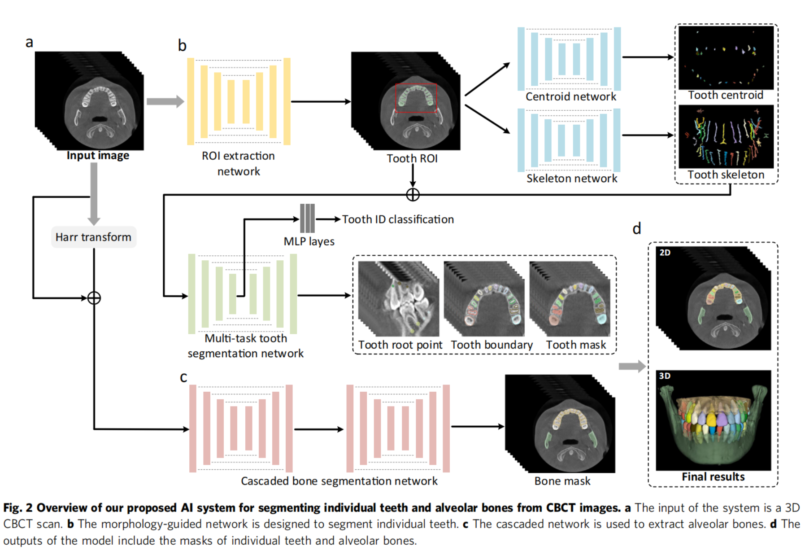

# 分割任务

##  一个全自动的人工智能系统的从锥束CT图像分割牙和牙槽骨

| 分类     | 内容                                                         |
| -------- | ------------------------------------------------------------ |
| 标题     | A fully automatic AI system for tooth and alveolar bone segmentation from cone-beam CT images    一个全自动的人工智能系统的从锥束CT图像分割牙和牙槽骨 |
| 作者     | Zhiming Cui 1,2,3,10, Yu Fang 1,10, Lanzhuju Mei1,10, Bojun Zhang4,10, Bo Yu5, Jiameng Liu1 , Caiwen Jiang1 ,Yuhang Sun1 , Lei Ma1 , Jiawei Huang1 , Yang Liu6, Yue Zhao7✉, Chunfeng Lian8✉, Zhongxiang Ding9✉,Min Zhu4✉ & Dinggang Shen1,3   含崔志明，沈定刚 |
| 单位     | 1上海理工大学生物医学工程学院，上海201210。 2香港大学计算机科学系，中国香港999077。 3上海联合成像智能有限公司，上海200030，中国。 4上海第九人民医院，上海交通大学，上海200011，中国。 5杭州医学院公共卫生学院，杭州310013，中国。 6中国重庆医科大学口腔医院正畸科，重庆401147。 7重庆邮电大学通信与信息工程学院，重庆400065。 8西安交通大学数学与统计学院，中国西安710049。 9浙江大学杭州第一人民医院放射科，杭州310006。 10这些作者的贡献相同：崔志明、于芳、兰竹菊梅、张伯军 |
| 发表时间 | 2022-4-19                                                    |
| 发表刊物 | nature communications                                        |
| 论文链接 | https://doi.org/10.1038/s41467-022-29637-2                   |
| 数据     | 在代码连接中有获取数据方式                                   |
| 代码     | [GitHub - ErdanC/Tooth-and-alveolar-bone-segmentation-from-CBCT](https://github.com/ErdanC/Tooth-and-alveolar-bone-segmentation-from-CBCT) |
| 摘要     |                                                              |

