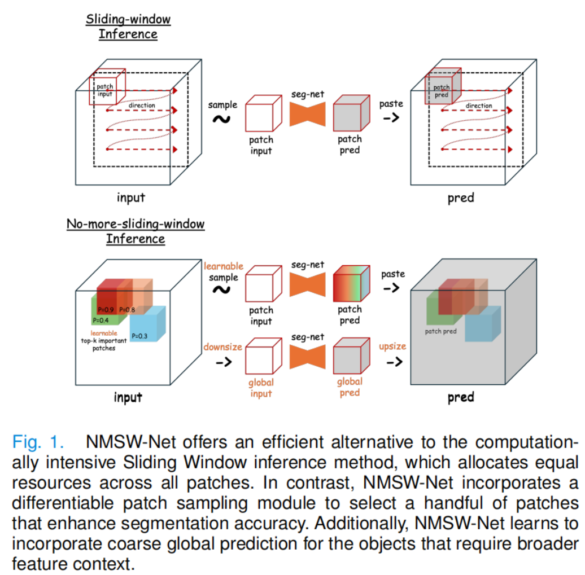
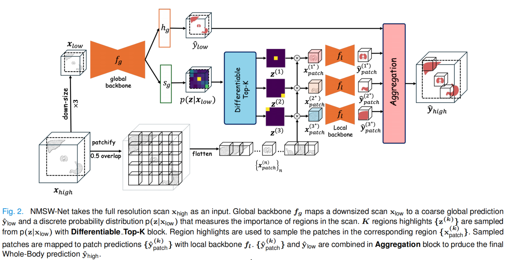
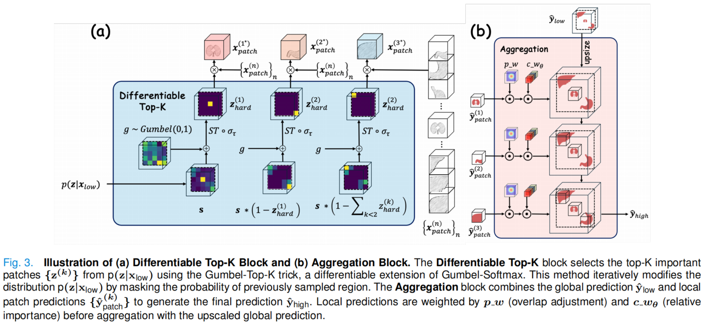

可以添加的网络：Attention U-net、Res U-net、、、

```markmap
# Unet
## AttentionUnet
### Attention U-Net: Learning Where to Look for the Pancreas
### 2020-3-19
## ResUnet
### A deep Residual U-Net convolutional neural network for automated lung segmentation in computed tomography images
### 2020-7-16
```


## Paper With Code

| 网络名称      | 代码                                                         |
| ------------- | ------------------------------------------------------------ |
| AttentionUnet | [GitHub - ztzhao6/Liver-Segmentation-with-AttentionUNet: Automatic Liver Segmentation of CT Volumes Using 2D Attention-UNet](https://github.com/ztzhao6/Liver-Segmentation-with-AttentionUNet) |
| ResUnet       |                                                              |
|               |                                                              |
|               |                                                              |


## 不再有滑动窗口：高效的三维医学图像分割与可区分的Top-k补丁采样

| 分类     | 内容                                                         |
| -------- | ------------------------------------------------------------ |
| 论文     | No More Sliding Window: Efficient 3D Medical Image Segmentation with Differentiable Top-k Patch Sampling <br>不再有滑动窗口：高效的三维医学图像分割与可区分的Top-k补丁采样 |
| 作者     | Young Seok Jeon, Hongfei Yang, Huazhu Fu , and Mengling Feng <br>杨穗、杨红飞、华付、冯梦玲 |
| 单位     | Jeon就职于新加坡国立大学数据科学研究所;<br>H. Yang在新加坡国立大学SSweeHock公共卫生学院;<br>H. Foo就职于新加坡科学、技术和研究局（A*STAR）<br>M.Feng（联合合作伙伴）是新加坡国立大学Saw Swee Hock公共卫生学院的成员; |
| 发表时间 | 2025-1-18                                                    |
| 发表期刊 | IEEE TRANSACTIONS ON MEDICAL IMAGING<br>IEEE医学影像汇刊     |
| 摘要     | 三维模型在三维医学图像分割任务中更受青睐，因为它们能够利用片间关系，产生更高的分割精度。然而，随着模型大小和中间张量的增加，3D模型需要显著的更多的GPU内存。一种常见的解决方案是使用基于补丁的训练，并使用滑动窗口（SW）推理进行全体积预测。软件推理减少了内存使用，但由于补丁之间的资源分配相同，速度较慢，由于它忽略了补丁之外的全局特性，因此精度较低。<br>我们提出了NMSW-Net（不再滑动-窗口-Net），这是一个新的框架，通过消除软件推理和必要时合并全局预测，可以提高任何给定的三维分割模型的效率和准确性。NMSW-Net集成了一个可微的Top-k模块，只采样相关的补丁，以提高分割精度，从而最大限度地减少冗余计算。此外，当补丁预测不足时，它学会利用粗糙的全局预测。NMSW-Net是模型无关的，使它与以前依赖于SW推理的任何三维分割模型兼容。<br>评估3个任务与3分割骨干，NMSW-Net达到竞争或有时优越的精度，同时降低90%（87.5 7→7.95 TFLOPS），在H100 GPU上提供4×更快的推理（19.0 7→4.3秒），在英特尔至强黄金CPU上提供7×更快的推理（1710→230秒）。 |
| 关键词   | 深度学习，三维医学图像分割，可微分top-k采样，软顶技巧，高效推理，滑动窗口推理。 |
| 关键术语 | Gumbel-Softmax                                               |











